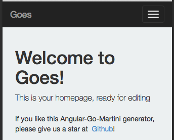

# Goes
Goes is a Golang Martini web front-end with oauth session control for Elasticsearch.

# Features

1. to control users to search their own database from ES
2. can oauth with all oauth service.

# Usage
```
$ go get github.com/mingderwang/goes

$ cd $GOPATH/github.com/mingderwang/goes && go get

$ go run server.go

//  or

$ grunt server
```
If it is not working. Try to bower and npm install again.
```
$ bower install && npm install
```

# Screenshot


# Contribute

# Thanks

[Generator-angular-go-martini](https://github.com/rayokota/generator-angular-go-martini)
[GopherCasts/Lessons](https://github.com/GopherCasts/Lessons.git)

# License
See LICENSE file.

---

My parts of this web site are licensed under
[CC BY](http://creativecommons.org/licenses/by/3.0/).

[](http://creativecommons.org/licenses/by/3.0/)
